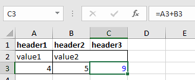

The main idea is taken from [XlsxWriter.php](https://gist.github.com/kunicmarko20/e0292280344761efbc7ff376f7080fec). 

Except:
- PHPExcel has been replaced with PHPOffice\Php Spreadsheet;
- The class is used as a service to be able to use it anywhere and make changes to the file.


# install

Run:

```bash
composer require --prefer-dist denisok94/symfony-export-xlsx
# or
php composer.phar require --prefer-dist denisok94/symfony-export-xlsx
```

or add to the `require` section of your `composer.json` file:

```json
"denisok94/symfony-export-xlsx": "*"
```

```bash
composer update
# or
php composer.phar update
```

# Use

```php
namespace App\Controller;

use Symfony\Bundle\FrameworkBundle\Controller\AbstractController;
use Symfony\Component\HttpFoundation\Response;
use Symfony\Component\HttpFoundation\ResponseHeaderBag;
use \Denisok94\SymfonyExportXlsxBundle\Service\Xlsx;

class ExportController extends AbstractController
{
    /** @var Xlsx */
    private $export;
    /**
     * @param Xlsx $export
     */
    public function __construct(Xlsx $export)
    {
        $this->export = $export;
    }
    /**
     * @return Response
     */
    public function index(): Response
    {
        $fileName = 'my_first_excel.xlsx';
        $temp_file = tempnam(sys_get_temp_dir(), $fileName);
        $this->export->setFile($temp_file)->open();
        $test = [
            ['header1' => 'value1', 'header2' => 'value2', 'header3' => 'value3'],
            ['header1' => 'value4', 'header2' => 'value5', 'header3' => 'value6']
        ];
        foreach ($test as $line) {
            $this->export->write($line);
        }
        $this->export->close();
        return $this->file($temp_file, $fileName, ResponseHeaderBag::DISPOSITION_INLINE);
    }
}
```


| Method | Parameters | Return | Description |
|----------------|:---------:|:---------:|:----------------|
| setFile() | string | self |  |
| setDateTimeFormat() | string | self |  |
| open() | - | - |  |
| write() | array | - |  |
| close() | - | - |  |


# Style

| Method | Return  | Official Documentation |
|----------------|:---------:|:----------------|
| getProperties() | Class Properties | https://phpoffice.github.io/PhpSpreadsheet/classes/PhpOffice-PhpSpreadsheet-Document-Properties.html |
| getSpreadsheet() | Class Spreadsheet | https://phpoffice.github.io/PhpSpreadsheet/namespaces/phpoffice-phpspreadsheet.html |
| getActiveSheet() | Class Worksheet | https://phpoffice.github.io/PhpSpreadsheet/namespaces/phpoffice-phpspreadsheet-worksheet.html |


```php
/**
 * @return Response
 */
public function index(): Response
{
    $fileName = 'my_first_excel.xlsx';
    $temp_file = tempnam(sys_get_temp_dir(), $fileName);
    $this->export->setFile($temp_file)->open();

    //
    $this->export->getProperties()
        ->setCreator('Denis')
        ->setLastModifiedBy('Denis')
        ->setSubject('my_first_excel')
        ->setTitle('my_first_excel');

    $test = [
        ['header1' => 'value1', 'header2' => 'value2', 'header3' => 'value3'],
        ['header1' => '4', 'header2' => '5', 'header3' => '=A3+B3']
    ];
    // header1 (A1) / header2 (B1) / header3 (C1) 
    // value1 (A2) / value2 (B2) / value3 (C2) 
    // 4 (A3) / 5 (B3) / =A3+B3 (C3) 
    foreach ($test as $line) {
        $this->export->write($line);
    }

    // https://phpoffice.github.io/PhpSpreadsheet/classes/PhpOffice-PhpSpreadsheet-Worksheet-Worksheet.html#method_mergeCells
    $this->export->getActiveSheet()->mergeCells('B2:C2');

    // https://phpoffice.github.io/PhpSpreadsheet/classes/PhpOffice-PhpSpreadsheet-Style-Borders.html
    $this->export->getActiveSheet()
        ->getStyle('A2:C3')->getBorders()->applyFromArray(['allBorders' => ['borderStyle' => 'thin', 'color' => ['rgb' => '000000']]]);

    // https://phpoffice.github.io/PhpSpreadsheet/classes/PhpOffice-PhpSpreadsheet-Style-Color.html
    $this->export->getActiveSheet()
        ->getStyle('C3')->getFont()->getColor()->applyFromArray(['rgb' => 'FF0000FF']);

    $this->export->close();

    return $this->file($temp_file, $fileName, ResponseHeaderBag::DISPOSITION_INLINE);
}
```

