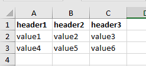

The main idea is taken from [XlsxWriter.php](https://gist.github.com/kunicmarko20/e0292280344761efbc7ff376f7080fec). 

Except:
- PHPOffice\PHPExcel has been replaced with PHPOffice\PhpSpreadsheet;
- The class is used as a service to be able to use it anywhere and make changes to the file.


0. [Install](#Install)
1. [Use Service](#Use-Service)
2. [Customization](#Customization)
3. [Use in SonataAdmin Export](#Use-in-SonataAdmin-Export)
4. [Errors](#Errors)

# Install

Run:

```bash
composer require --prefer-dist denisok94/symfony-export-xlsx
# or
php composer.phar require --prefer-dist denisok94/symfony-export-xlsx
```

or add to the `require` section of your `composer.json` file:

```json
"denisok94/symfony-export-xlsx": "*"
```

```bash
composer update
# or
php composer.phar update
```

# Use Service

| Method | Parameters | Return | Description |
|----------------|:---------:|:---------:|:----------------|
| setFile() | string | self |  |
| setDateTimeFormat() | string | self |  |
| open() | - | - |  |
| write() | array | - |  |
| close() | - | - |  |

```php
namespace App\Controller;

use Symfony\Bundle\FrameworkBundle\Controller\AbstractController;
use Symfony\Component\HttpFoundation\Response;
use Symfony\Component\HttpFoundation\ResponseHeaderBag;
use \Denisok94\SymfonyExportXlsxBundle\Service\XlsxService;

class ExportController extends AbstractController
{
    /** @var XlsxService */
    private $export;
    /**
     * @param XlsxService $export
     */
    public function __construct(XlsxService $export)
    {
        $this->export = $export;
    }
    /**
     * @return Response
     */
    public function index(): Response
    {
        $fileName = 'my_first_excel.xlsx';
        $temp_file = tempnam(sys_get_temp_dir(), $fileName);
        $this->export->setFile($temp_file)->open();
        $test = [
            ['header1' => 'value1', 'header2' => 'value2', 'header3' => 'value3'],
            ['header1' => 'value4', 'header2' => 'value5', 'header3' => 'value6']
        ];
        foreach ($test as $line) {
            $this->export->write($line);
        }
        $this->export->close();
        return $this->file($temp_file, $fileName, ResponseHeaderBag::DISPOSITION_INLINE);
    }
}
```


# Customization

| Method | Return  | Official Documentation |
|----------------|:---------:|:----------------|
| getProperties() | Class Properties | https://phpoffice.github.io/PhpSpreadsheet/classes/PhpOffice-PhpSpreadsheet-Document-Properties.html |
| getSpreadsheet() | Class Spreadsheet | https://phpoffice.github.io/PhpSpreadsheet/namespaces/phpoffice-phpspreadsheet.html |
| getActiveSheet() | Class Worksheet | https://phpoffice.github.io/PhpSpreadsheet/namespaces/phpoffice-phpspreadsheet-worksheet.html |

```php
use \Denisok94\SymfonyExportXlsxBundle\Service\XlsxService;
/** @var XlsxService */
private $export;
/**
 * @param XlsxService $export
 */
public function __construct(XlsxService $export)
{
    $this->export = $export;
}
/**
 * @return Response
 */
public function index(): Response
{
    $fileName = 'my_first_excel.xlsx';
    $temp_file = tempnam(sys_get_temp_dir(), $fileName);
    $this->export->setFile($temp_file)->open();

    //
    $this->export->getProperties()
        ->setCreator('Denis')
        ->setLastModifiedBy('Denis')
        ->setSubject('my_first_excel')
        ->setTitle('my_first_excel');

    $test = [
        ['header1' => 'value1', 'header2' => 'value2', 'header3' => 'value3'],
        ['header1' => '4', 'header2' => '5', 'header3' => '=A3+B3']
    ];
    // header1 (A1) / header2 (B1) / header3 (C1) 
    // value1 (A2) / value2 (B2) / value3 (C2) 
    // 4 (A3) / 5 (B3) / =A3+B3 (C3) 
    foreach ($test as $line) {
        $this->export->write($line);
    }

    // https://phpoffice.github.io/PhpSpreadsheet/classes/PhpOffice-PhpSpreadsheet-Worksheet-Worksheet.html#method_mergeCells
    $this->export->getActiveSheet()->mergeCells('B2:C2');

    // https://phpoffice.github.io/PhpSpreadsheet/classes/PhpOffice-PhpSpreadsheet-Style-Borders.html
    $this->export->getActiveSheet()
        ->getStyle('A2:C3')->getBorders()->applyFromArray(['allBorders' => ['borderStyle' => 'thin', 'color' => ['rgb' => '000000']]]);

    // https://phpoffice.github.io/PhpSpreadsheet/classes/PhpOffice-PhpSpreadsheet-Style-Color.html
    $this->export->getActiveSheet()
        ->getStyle('C3')->getFont()->getColor()->applyFromArray(['rgb' => 'FF0000FF']);

    $this->export->close();

    return $this->file($temp_file, $fileName, ResponseHeaderBag::DISPOSITION_INLINE);
}
```


# Use in SonataAdmin Export

Install if missing `SonataExporterBundle`
```bash
composer require sonata-project/exporter
```
Minimum version __`doctrine/orm`: 2.8__

add in `config`:
```yaml
# ~config/packages/sonata_exporter.yaml
services:
  sonata.exporter.writer.xlsx:
    class: Denisok94\SymfonyExportXlsxBundle\Writer\XlsxWriter
    arguments: ["php://output"]
    tags:
      - { name: sonata.exporter.writer }
```

add in `YourAdmin` class [according to the documentation](https://docs.sonata-project.org/projects/SonataAdminBundle/en/4.x/reference/action_export/):
```php
public function getExportFormats(): array
{
    return ['xlsx'];
}
```
and if you need to configure the fields and their translation
```php
protected function configureExportFields(): array
{
    // example:
    return [
        $this->trans('export.title') => 'title',
        $this->trans('export.anons') => 'text',
        $this->trans('export.date') => 'date'
    ];
}
```

# Errors

If you see the error:
```
Attempted to call an undefined method named "toIterable" of class "Doctrine\ORM\Query"
```
Then make sure that the __`doctrine/orm`__ version is __`2.8`__ or __higher__.

You may need to update:
- sonata-project/admin-bundle: ~`3.*`
- sonata-project/doctrine-orm-admin-bundle: ~`3.*`
- doctrine/doctrine-bundle: ~`^2.3`